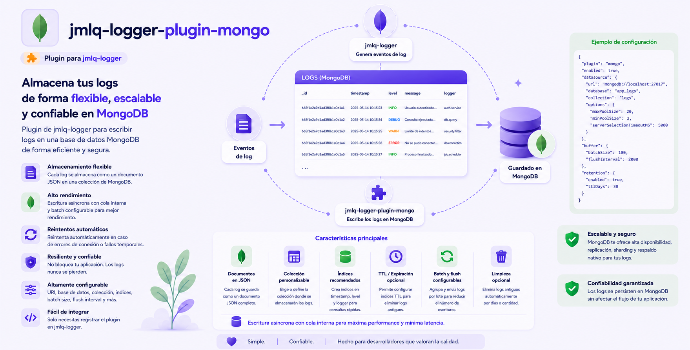

# @jmlq/logger-plugin-mongo 🍃



Plugin de persistencia para **MongoDB** compatible con `@jmlq/logger`.

Este paquete implementa un datasource que cumple el contrato `ILogDatasource` del core, permitiendo:

- Guardar logs en MongoDB
- Crear colección (opcional) y gestionar índices (opcional)
- Definir retención vía TTL (opcional) y/o limpieza por estrategia (según configuración)

---

## 🎯 Objetivo

Ofrecer una implementación MongoDB **desacoplada** (Clean Architecture) para el sistema de logging `@jmlq/logger`, manteniendo:

- Core sin dependencias a MongoDB
- Persistencia como plugin reutilizable
- Contratos claros para testing y extensiones

## ⭐ Importancia

MongoDB es un destino común para logs cuando se requiere:

- escritura rápida
- consultas flexibles por filtros (nivel, source, fechas, texto)
- retención automática (TTL)

Este plugin encapsula los detalles del driver y mantiene el host con integración limpia.

---

## 🏗 Arquitectura (visión rápida)

- **Entrada recomendada:** `createMongoDatasource(options)`
- Implementa `ILogDatasource` y se integra a `createLogger({ datasources: [...] })`
- Separa:
  - Domain (ports/models)
  - Application (use-cases/factory)
  - Infrastructure (repositorio + schema/index)

➡️ Ver detalle en: [architecture.md](./docs/es/architecture.md)

---

## 🔧 Implementación

### 5.1 Instalación

```bash
npm i @jmlq/logger @jmlq/logger-plugin-mongo mongodb
```

### 5.2 Dependencias

- `@jmlq/logger` (core)
- `mongodb` (driver oficial en el host; el plugin usa un port `IMongoQueryClient` para no acoplarse)

### 5.3 Uso (crear datasource + conectar con core)

El flujo típico es:

1. Implementar/adaptar un `IMongoQueryClient` usando el driver oficial.
2. Crear el datasource vía `createMongoDatasource(...)`.
3. Pasarlo a `createLogger(...)`.

#### Factory principal (plugin)

```ts
----------------------------------------------------------------
import {
  SaveLogUseCase,
  FindLogsUseCase,
  PruneLogsUseCase,
  EnsureSchemaUseCase,
} from "../../application/use-cases";

/**
 * createMongoDatasource
 * -----------------------------------------------------------------------------
 * Composition Root del plugin MongoDB.
 *
 * Responsabilidad:
 * - Construir el grafo de dependencias (repo, services, use-cases)
 * - Exponer un ILogDatasource compatible con @jmlq/logger
 *
 * Clean Architecture:
 * - Vive en application (consistente con PostgreSQL).
 * - No depende del driver mongodb.
 * - El host provee el IMongoQueryClient.
 */
export async function createMongoDatasource(
  opts: IMongoDatasourceOptions
): Promise<ILogDatasource> {
  const dbName = opts.dbName;
  const collectionName = opts.collectionName ?? "logs";

  // ---------------------------------------------------------------------------
  // 1) Repository (infraestructura) — Mongo real solo vía IMongoQueryClient
  // ---------------------------------------------------------------------------
  const repo = new MongoLogsRepository(opts.client, dbName, collectionName);

  // ---------------------------------------------------------------------------
  // 2) Bootstrap opcional (asegurar colección + índices + TTL)
  // ---------------------------------------------------------------------------
  const createIfMissing = opts.createIfMissing ?? true;
  const ensureIndexes = opts.ensureIndexes ?? true;

  const ensureSchemaUseCase =
    createIfMissing || ensureIndexes
      ? new EnsureSchemaUseCase(
          opts.client,
          dbName,
          collectionName,
          createIfMissing,
          ensureIndexes,
          opts.retentionDays ?? null,
          opts.extraIndexes ?? []
        )
      : undefined;

  if (ensureSchemaUseCase) {
    await ensureSchemaUseCase.execute();
  }

  // ---------------------------------------------------------------------------
  // 3) Use-cases (application)
  // ---------------------------------------------------------------------------
  const saveLogUseCase = new SaveLogUseCase(repo);
  const findLogsUseCase = new FindLogsUseCase(repo);
  const pruneLogsUseCase = opts.enablePrune
    ? new PruneLogsUseCase(repo)
    : undefined;

  // ---------------------------------------------------------------------------
  // 4) Adapter (infraestructura) que expone contrato del core
  // ---------------------------------------------------------------------------
  return new MongoDatasourceAdapter(
    saveLogUseCase,
    findLogsUseCase,
    ensureSchemaUseCase,
    pruneLogsUseCase
  );
}


---
//src/application/factory/index.ts

export * from "./create-mongo-datasource.factory";


---
//src/application/index.ts

export * from "./factory";
export * from "./use-
```

➡️ Más detalle: [docs/integration-express.md](./docs/es/integration-express.md)

### 5.4 Variables de entorno (.env)

Este plugin **no lee env vars por sí mismo**. Se recomienda leerlas en infraestructura del host:

```ts
const mongoUrl = process.env.LOGGER_MONGO_DB_URL;
const dbName = process.env.LOGGER_MONGO_DB_NAME;
const collectionName = process.env.LOGGER_MONGO_COLLECTION_NAME;
```

➡️ Ver configuración completa: [docs/configuration.md](./docs/es/configuration.md)

### 5.5 Helpers / funcionalidades relevantes

- **ensureIndexes**: creación/verificación de índices (si está habilitado)
- **retentionDays**: retención (TTL) cuando aplique según implementación del schema service
- **extraIndexes**: índices adicionales (por ejemplo `{
  key: { level: 1, source: 1 }
}`)

---

## ✅ Checklist

- Instalar `@jmlq/logger` + `@jmlq/logger-plugin-mongo` + `mongodb`
- Crear `IMongoQueryClient` con `MongoClient`
- Crear datasource con `createMongoDatasource(options)`
- Integrar con `createLogger({ datasources: [...] })`
- Configurar índices/retención (opcional)
- Integrar en Express (middleware `req.logger`) (opcional)

## 🧩 Implementation Example

- [View real integration and documentation](https://github.com/MLahuasi/jmlq-ecosystem/blob/main/doc/es/%40jmlq/logger/mongo.md)

---

## 📌 Menú

- [Arquitectura](./docs/es/architecture.md)
- [Configuración](./docs/es/configuration.md)
- [Integración Express](./docs/es/integration-express.md)
- [Troubleshooting](./docs/es/troubleshooting.md)

## 🔗 Referencias

- [`@jmlq/logger`](https://github.com/MLahuasi/jmlq-logger/blob/main/README.es.md)
- Plugins relacionados del ecosistema:
  - [`@jmlq/logger-plugin-fs`](https://github.com/MLahuasi/jmlq-logger-plugin-fs/blob/main/README.es.md)
  - [`@jmlq/logger-plugin-postgresql`](https://github.com/MLahuasi/jmlq-logger-plugin-postgresql/blob/main/README.es.md)

## ⬅️ 🌐 Ecosistema

- [`@jmlq`](https://github.com/MLahuasi/jmlq-ecosystem#readme)
