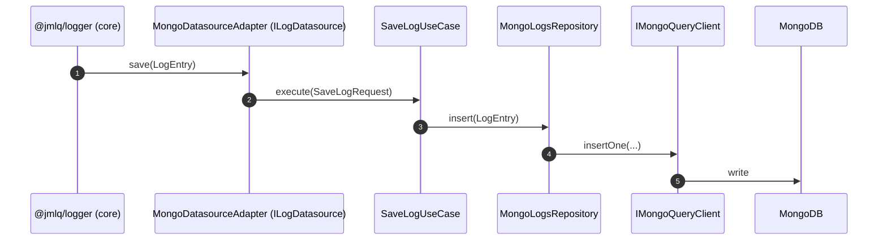
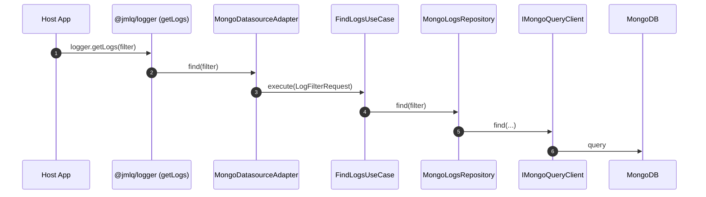
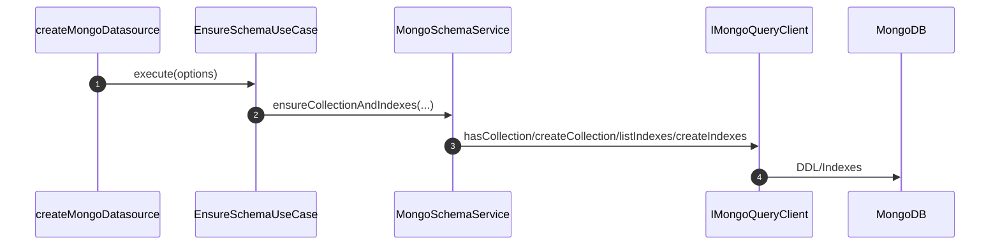

# @jmlq/logger-plugin-mongo — Architecture 🏛️

## 🎯 Objective

Document the real architecture of the MongoDB plugin for `@jmlq/logger`, showing:

- Layers (Domain / Application / Infrastructure)
- Contracts (ports) and responsibilities
- Write/read flow and schema/index management

---

## 🧩 Clean Architecture (dependency direction)

```text
Domain ← Application ← Infrastructure
```

- **Domain** defines contracts (ports) and models.
- **Application** orchestrates use cases and exposes factories.
- **Infrastructure** implements concrete repositories/services over MongoDB (via `IMongoQueryClient`).

---

## 🧱 Layers and components

### 1) Domain

Typical components of the plugin (based on implementation):

- `LogEntry` (log model)
- `LogFilterRequest` / `SaveLogRequest`
- `ILogDatasource` (contract exposed to the core)
- `IMongoQueryClient` (MongoDB driver contract)
- `IMongoLogsRepository` (logs repository)
- `ISchemaInitializerPort` (collection/index initialization)

#### Main port: `IMongoQueryClient`

```ts
export interface MongoCreateIndexOptions {
  name?: string;
  unique?: boolean;
  expireAfterSeconds?: number;
}

export interface IMongoQueryClient {
  // lifecycle (handled by the host)
  connect(): Promise<void>;
  close(): Promise<void>;

  // collection ops
  hasCollection(dbName: string, collectionName: string): Promise<boolean>;
  createCollection(dbName: string, collectionName: string): Promise<void>;

  // data ops
  insertOne<T = any>(
    dbName: string,
    collectionName: string,
    document: T
  ): Promise<IMongoQueryResult<T>>;

  find<T = any>(
    dbName: string,
    collectionName: string,
    filter?: Record<string, any>,
    options?: { limit?: number; skip?: number; sort?: Record<string, 1 | -1> }
  ): Promise<IMongoQueryResult<T>>;

  deleteMany(
    dbName: string,
    collectionName: string,
    filter: Record<string, any>
  ): Promise<IMongoQueryResult>;

  // index ops
  listIndexes(
    dbName: string,
    collectionName: string
  ): Promise<MongoIndexInfo[]>;
  createIndex(
    dbName: string,
    collectionName: string,
    key: MongoIndexKey,
    options?: MongoCreateIndexOptions
  ): Promise<void>;
  dropIndex(
    dbName: string,
    collectionName: string,
    indexName: string
  ): Promise<void>;
}

---
//src/domain/ports/mongo/schema-initializer.port.ts

export interface ISchemaInitializerPort {
  ensureSchema(): Promise<void>;
}

---
//src/domain/request/index.ts

export * from "./log-filter.request";
export * from "./save-log.request";

---
//src/domain/request/log-filter.request.ts

import { LogLevel } from "../value-objects";

// Optional filter to retrieve logs from a datasource
export interface LogFilterRequest {
  levelMin?: LogLevel;
  since?: number;
  until?: number;
  limit?: number;
  offset?: number;
  query?: string;
}
```

---

### 2) Application

- Typical use cases:
  - `SaveLogUseCase`
  - `FindLogsUseCase`
  - `EnsureSchemaUseCase` (collection/indexes/TTL)
  - `PruneLogsUseCase` (if enabled)

- Main factory:
  - `createMongoDatasource(options)`

#### Options: `IMongoDatasourceOptions`

```ts
import { IMongoQueryClient } from "../../domain/ports";
import { ExtraIndexConfig } from "../../infrastructure/types";

export interface IMongoDatasourceOptions {
  client: IMongoQueryClient;

  dbName: string;
  collectionName?: string;

  // bootstrap
  createIfMissing?: boolean;
  ensureIndexes?: boolean;

  // retention
  retentionDays?: number | null;
  enablePrune?: boolean;

  // indexes
  extraIndexes?: ExtraIndexConfig[];
}

---
//src/application/use-cases/ensure-schema.use-case.ts

import type { IMongoQueryClient } from "../../domain/ports";
import type { ExtraIndexConfig } from "../../infrastructure/types";
import { bootstrapMongoCollectionAndIndexes } from "../../infrastructure/services";

export class EnsureSchemaUseCase {
  constructor(
    private readonly client: IMongoQueryClient,
    private readonly dbName: string,
    private readonly collectionName: string,
    private readonly createIfMissing: boolean,
    private readonly ensureIndexes: boolean,
    private readonly retentionDays: number | null,
    private readonly extraIndexes: ExtraIndexConfig[]
  ) {}

  async execute(): Promise<void> {
    await bootstrapMongoCollectionAndIndexes({
      client: this.client,
      dbName: this.dbName,
      collectionName: this.collectionName,
      createIfMissing: this.createIfMissing,
      ensureIndexes: this.ensureIndexes
```

---

### 3) Infrastructure

- Datasource adapter implementing `ILogDatasource` for the core.
- MongoDB repository for insert/query.
- Schema/index service (collection, TTL, extraIndexes).

#### Adapter: `MongoDatasourceAdapter`

```ts
export class MongoDatasourceAdapter implements ILogDatasource {
  readonly name = "mongo";

  constructor(
    private readonly saveLogUseCase: SaveLogUseCase,
    private readonly findLogsUseCase: FindLogsUseCase,
    private readonly ensureSchemaUseCase?: EnsureSchemaUseCase,
    private readonly pruneLogsUseCase?: PruneLogsUseCase,
  ) {}

  async save(log: CoreLogEntry): Promise<void> {
    const dto: SaveLogRequest = { log };
    await this.saveLogUseCase.execute(dto);
  }

  async find(filter?: LogSearchRequest): Promise<LogRecord[]> {
    const domainFilter = (filter ?? {}) as any;
    const result = await this.findLogsUseCase.execute(domainFilter);
    return result as any;
  }

  async flush(): Promise<void> {
    // noop
  }

  async dispose(): Promise<void> {
    // noop
  }

  async ensureSchema(): Promise<void> {
    if (!this.ensureSchemaUseCase) return;
    await this.ensureSchemaUseCase.execute();
  }

  async pruneOlderThan(days: number): Promise<number> {
    if (!this.pruneLogsUseCase) return 0;
    return this.pruneLogsUseCase.execute({ days });
  }
}
```

---

#### Repository: `MongoLogsRepository`

```ts
export class MongoLogsRepository implements IMongoLogsRepository {
  constructor(
    private readonly client: IMongoQueryClient,
    private readonly dbName: string,
    private readonly collection: string,
  ) {}

  async healthcheck(): Promise<void> {
    await this.client.find(this.dbName, this.collection, {}, { limit: 1 });
  }

  async insert(log: LogEntry): Promise<void> {
    await this.client.insertOne(this.dbName, this.collection, {
      source: log.source ?? null,
      timestamp: log.timestamp,
      level: log.level,
      message: log.message,
      meta: log.meta ?? null,
    });
  }

  async find(filter: LogFilterRequest): Promise<ILogResponse[]> {
    const f = filter ?? {};
    const query: Record<string, any> = {};

    if (f.levelMin != null) {
      query.level = { ...(query.level ?? {}), $gte: f.levelMin };
    }

    if (f.since != null) {
      query.timestamp = { ...(query.timestamp ?? {}), $gte: f.since };
    }

    if (f.until != null) {
      query.timestamp = { ...(query.timestamp ?? {}), $lte: f.until };
    }

    if (f.query && f.query.trim().length > 0) {
      query.message = { $regex: f.query.trim(), $options: "i" };
    }

    const options = {
      sort: { timestamp: 1 },
    };

    return (await this.client.find(
      this.dbName,
      this.collection,
      query,
      options,
    )) as any;
  }
}
```

---

#### Schema / Index Service

```ts
export async function ensureMongoSchema(opts: {
  client: IMongoQueryClient;
  dbName: string;
  collectionName: string;
  retentionDays: number | null;
  extraIndexes: ExtraIndexConfig[];
}): Promise<void> {
  const { client, dbName, collectionName, retentionDays, extraIndexes } = opts;

  await client.createIndex(
    dbName,
    collectionName,
    { level: 1, timestamp: 1 },
    { name: "idx_level_ts" }
  );

  const existing = await client.listIndexes(dbName, collectionName);

  const useTTL = typeof retentionDays === "number" && retentionDays > 0;

  if (useTTL) {
    const expireAfterSeconds = Math.ceil(retentionDays * 24 * 60 * 60);
```

---

## 🔁 Flows

### Write (save)



### Read (find)



### Schema / index initialization (optional)



---

## 🧰 Host integration

When the host implements the connection adapter, it usually:

- Resolves URI from `process.env.LOGGER_MONGO_DB_URL`
- Builds `MongoClient`
- Implements `IMongoQueryClient`
- Creates the datasource and connects it

---

## 🔗 References

## ⬅️ Previous

- [`home`](../../README.md)

## ➡️ Next

- [Configuration](./configuration.md)
- [Express Integration](./integration-express.md)
- [Troubleshooting](./troubleshooting.md)
