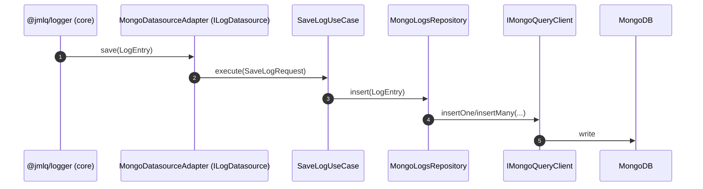
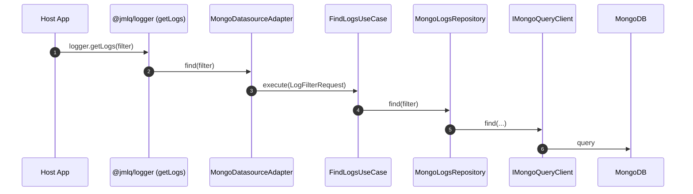
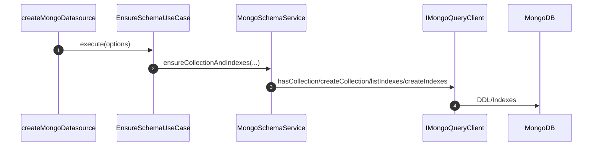

# @jmlq/logger-plugin-mongo — Architecture 🏛️

## 🎯 Objetivo

Documentar la arquitectura real del plugin MongoDB para `@jmlq/logger`, mostrando:

- Capas (Domain / Application / Infrastructure)
- Contratos (ports) y responsabilidades
- Flujo de escritura/lectura y gestión de esquema/índices

---

## 🧩 Clean Architecture (dirección de dependencias)

```text
Domain ← Application ← Infrastructure
```

- **Domain** define los contratos (ports) y modelos.
- **Application** orquesta casos de uso y expone factories.
- **Infrastructure** implementa repositorios/servicios concretos sobre MongoDB (vía `IMongoQueryClient`).

---

## 🧱 Capas y componentes

### 1) Domain

Componentes típicos del plugin (según implementación):

- `LogEntry` (modelo de log)
- `LogFilterRequest` / `SaveLogRequest`
- `ILogDatasource` (contrato que el plugin expone al core)
- `IMongoQueryClient` (contrato del driver MongoDB)
- `IMongoLogsRepository` (repositorio de logs)
- `ISchemaInitializerPort` (inicialización de colección/índices)

#### Port principal: `IMongoQueryClient`

```ts
xport interface MongoCreateIndexOptions {
  name?: string;
  unique?: boolean;
  expireAfterSeconds?: number;
}

export interface IMongoQueryClient {
  // lifecycle (el host decide si los usa)
  connect(): Promise<void>;
  close(): Promise<void>;

  // collection ops
  hasCollection(dbName: string, collectionName: string): Promise<boolean>;
  createCollection(dbName: string, collectionName: string): Promise<void>;

  // data ops
  insertOne<T = any>(
    dbName: string,
    collectionName: string,
    document: T
  ): Promise<IMongoQueryResult<T>>;

  find<T = any>(
    dbName: string,
    collectionName: string,
    filter?: Record<string, any>,
    options?: { limit?: number; skip?: number; sort?: Record<string, 1 | -1> }
  ): Promise<IMongoQueryResult<T>>;

  deleteMany(
    dbName: string,
    collectionName: string,
    filter: Record<string, any>
  ): Promise<IMongoQueryResult>;

  // index ops
  listIndexes(
    dbName: string,
    collectionName: string
  ): Promise<MongoIndexInfo[]>;
  createIndex(
    dbName: string,
    collectionName: string,
    key: MongoIndexKey,
    options?: MongoCreateIndexOptions
  ): Promise<void>;
  dropIndex(
    dbName: string,
    collectionName: string,
    indexName: string
  ): Promise<void>;
}


---
//src/domain/ports/mongo/schema-initializer.port.ts

export interface ISchemaInitializerPort {
  ensureSchema(): Promise<void>;
}


---
//src/domain/request/index.ts

export * from "./log-filter.request";
export * from "./save-log.request";


---
//src/domain/request/log-filter.request.ts

import { LogLevel } from "../value-objects";

// Filtro opcional para recuperar logs desde un datasource
export interface LogFilterRequest {
  levelMin?: LogLevel; // recuperar desde un nivel mínimo
  since?: number; // epoch millis desde
  until?: number; // epoch millis hasta
  limit?: number; // máximo de elementos
  offset?: number; // desplazamiento para paginación
  query?: string; /
```

---

### 2) Application

- Use cases típicos:
  - `SaveLogUseCase`
  - `FindLogsUseCase`
  - `EnsureSchemaUseCase` (colección/índices/TTL)
  - `PruneLogsUseCase` (si aplica)

- Factory principal:
  - `createMongoDatasource(options)`

#### Opciones: `IMongoDatasourceOptions`

```ts
{ IMongoQueryClient } from "../../domain/ports";
import { ExtraIndexConfig } from "../../infrastructure/types";

export interface IMongoDatasourceOptions {
  client: IMongoQueryClient;

  dbName: string;
  collectionName?: string;

  // bootstrap
  createIfMissing?: boolean;
  ensureIndexes?: boolean;

  // retention
  retentionDays?: number | null;
  enablePrune?: boolean;

  // indexes
  extraIndexes?: ExtraIndexConfig[];
}


---
//src/application/use-cases/ensure-schema.use-case.ts

import type { IMongoQueryClient } from "../../domain/ports";
import type { ExtraIndexConfig } from "../../infrastructure/types";
import { bootstrapMongoCollectionAndIndexes } from "../../infrastructure/services";

export class EnsureSchemaUseCase {
  constructor(
    private readonly client: IMongoQueryClient,
    private readonly dbName: string,
    private readonly collectionName: string,
    private readonly createIfMissing: boolean,
    private readonly ensureIndexes: boolean,
    private readonly retentionDays: number | null,
    private readonly extraIndexes: ExtraIndexConfig[]
  ) {}

  async execute(): Promise<void> {
    await bootstrapMongoCollectionAndIndexes({
      client: this.client,
      dbName: this.dbName,
      collectionName: this.collectionName,
      createIfMissing: this.createIfMissing,
      ensureIndexes: this.ensureIndexes
```

---

### 3) Infrastructure

- Adapter datasource que implementa `ILogDatasource` para el core.
- Repositorio MongoDB para insertar/consultar.
- Servicio de esquema/índices (colección, TTL, extraIndexes).

#### Adapter: `MongoDatasourceAdapter`

```ts
* - NO conoce mongodb (driver).
 * - NO gestiona el lifecycle de conexiones (eso lo maneja el factory/host).
 */
export class MongoDatasourceAdapter implements ILogDatasource {
  readonly name = "mongo";

  constructor(
    private readonly saveLogUseCase: SaveLogUseCase,
    private readonly findLogsUseCase: FindLogsUseCase,
    private readonly ensureSchemaUseCase?: EnsureSchemaUseCase,
    private readonly pruneLogsUseCase?: PruneLogsUseCase
  ) {}

  // ---------------------------------------------------------------------------
  // Core contract
  // ---------------------------------------------------------------------------

  async save(log: CoreLogEntry): Promise<void> {
    const dto: SaveLogRequest = { log };
    await this.saveLogUseCase.execute(dto);
  }

  async find(filter?: LogSearchRequest): Promise<LogRecord[]> {
    // Si tu dominio usa el mismo shape que el core:
    const domainFilter = (filter ?? {}) as any;

    const result = await this.findLogsUseCase.execute(domainFilter);

    // Si el use-case retorna ILogResponse dominio, mapearías aquí.
    // Si ya retorna LogRecord del core, devuelves directo.
    return result as any;
  }

  /**
   * Mongo en este plugin no tiene buffer interno.
   * Se implementa por estandarización del contrato.
   */
  async flush(): Promise<void> {
    // noop
  }

  /**
   * Este adapter NO es dueño del client/conexión.
   * El ciclo de vida lo gestiona el factory/host.
   */
  async dispose(): Promise<void> {
    // noop
  }

  // ---------------------------------------------------------------------------
  // Plugin features (opcionales)
  // ---------------------------------------------------------------------------

  /**
   * Inicializa colección/índices/TTL (si el factory inyectó EnsureSchemaUseCase).
   * NO forma parte del contrato core, pero unifica el rol de MongoSchemaInitializer.
   */
  async ensureSchema(): Promise<void> {
    if (!this.ensureSchemaUseCase) return;
    await this.ensureSchemaUseCase.execute();
  }

  /**
   * Retención manual (si el factory inyectó PruneLogsUseCase).
   */
  async pruneOlderThan(days: number): Promise<number> {
    if (!this.pruneLogsUseCase) return 0;
    return this.pruneLogsUseCase.execute({ days });
  }
}


---
//src/infrastructure/repositories/index.ts

export * from "./mongo-logs.repository";


---
//src/infrastructure/repositories/mongo-logs.repository.ts

import { LogEntry } from "../../domain/model";
import { LogFilterRequest } from "../../domain/request";
import { ILogResponse } from "../../domain/response";
import { IMongoLogsRepository, IMongoQueryClient } from "../../domain/ports";

/**
```

#### Repository: `MongoLogsRepository`

```ts
iver mongodb
 * - Usa IMongoQueryClient (puerto)
 * - Mantiene la misma semántica que PostgresLogsRepository
 */
export class MongoLogsRepository implements IMongoLogsRepository {
  constructor(
    private readonly client: IMongoQueryClient,
    private readonly dbName: string,
    private readonly collection: string
  ) {}

  // ---------------------------------------------------------------------------
  // HEALTHCHECK
  // ---------------------------------------------------------------------------

  async healthcheck(): Promise<void> {
    // Operación mínima y segura
    await this.client.find(this.dbName, this.collection, {}, { limit: 1 });
  }

  // ---------------------------------------------------------------------------
  // INSERT
  // ---------------------------------------------------------------------------

  async insert(log: LogEntry): Promise<void> {
    await this.client.insertOne(this.dbName, this.collection, {
      source: log.source ?? null,
      timestamp: log.timestamp,
      level: log.level,
      message: log.message,
      meta: log.meta ?? null,
    });
  }

  // ---------------------------------------------------------------------------
  // FIND
  // ---------------------------------------------------------------------------

  async find(filter: LogFilterRequest): Promise<ILogResponse[]> {
    const f = filter ?? {};
    const query: Record<string, any> = {};

    if (f.levelMin != null) {
      query.level = { ...(query.level ?? {}), $gte: f.levelMin };
    }

    if (f.since != null) {
      query.timestamp = { ...(query.timestamp ?? {}), $gte: f.since };
    }

    if (f.until != null) {
      query.timestamp = { ...(query.timestamp ?? {}), $lte: f.until };
    }

    if (f.query && f.query.trim().length > 0) {
      query.message = { $regex: f.query.trim(), $options: "i" };
    }

    // Estrategia idéntica a Postgres:
    // 1) ordenar ASC
    // 2) paginar
    // 3) invertir en memoria (DESC final)
    const options: {
      sort?: Record<string, 1 | -1>;
      limit?: number;
      skip?: number;
    } = {
      sort: { timestamp: 1 },
    };

    const hasLimit = typeof f.limit === "number";
    const hasOffsetPage =
      typeof f.offset === "number" && Number.isFinite(f.offset) && f.offset > 0;

    if (hasLimit) {
      options.limit = f.limit;

      if (ha
```

#### Schema / Index Service

```ts
,
    });

    return res.deletedCount ?? 0;
  }
}


---
//src/infrastructure/services/index.ts

export * from "./mongo-schema.service";


---
//src/infrastructure/services/mongo-schema.service.ts

import { IMongoQueryClient, MongoIndexInfo } from "../../domain/ports";
import type { ExtraIndexConfig, MongoInfra, MongoPluginConfig } from "../types";

/**
 * Helper interno (no export): asegura la colección si hace falta.
 */
async function ensureMongoCollectionIfNeeded(opts: {
  client: IMongoQueryClient;
  dbName: string;
  collectionName: string;
  createIfMissing: boolean;
}): Promise<void> {
  const { client, dbName, collectionName, createIfMissing } = opts;

  const exists = await client.hasCollection(dbName, collectionName);

  if (!exists) {
    if (!createIfMissing) {
      throw new Error(
        `Mongo collection "${collectionName}" does not exist and createIfMissing=false`
      );
    }
    await client.createCollection(dbName, collectionName);
  }
}

/**
 * ensureMongoSchema
 * -----------------------------------------------------------------------------
 * Asegura índices base + TTL opcional + índices extra.
 *
 * Regla:
 * - Siempre crea el índice compuesto { level: 1, timestamp: 1 }
 * - Re-crea SIEMPRE el índice simple sobre timestamp para aplicar TTL deseado:
 *    - si retentionDays > 0 => { timestamp: 1 } + expireAfterSeconds
 *    - si no => { timestamp: 1 } sin TTL
 */
export async function ensureMongoSchema(opts: {
  client: IMongoQueryClient;
  dbName: string;
  collectionName: string;
  retentionDays: number | null;
  extraIndexes: ExtraIndexConfig[];
}): Promise<void> {
  const { client, dbName, collectionName, retentionDays, extraIndexes } = opts;

  // 1) Índice compuesto base (idempotente por name)
  await client.createIndex(
    dbName,
    collectionName,
    { level: 1, timestamp: 1 },
    { name: "idx_level_ts" }
  );

  // 2) Re-crear índice timestamp para aplicar TTL deseado
  const existing = await client.listIndexes(dbName, collectionName);

  const onlyTimestamp = findOnlyTimestampIndex(existing);
  if (onlyTimestamp) {
    await client.dropIndex(dbName, collectionName, onlyTimestamp.name);
  }

  const useTTL = typeof retentionDays === "number" && retentionDays > 0;

  if (useTTL) {
    const expireAfterSeconds = Math.ceil(retentionDays * 24 * 60 * 60);
```

---

## 🔁 Flujos

### Escritura (save)



### Lectura (find)



### Inicialización de esquema/índices (opcional)



---

## 🧰 Integración en host — evidencia en sources

Cuando el host implementa el adapter de conexión, normalmente:

- Resuelve URI desde `process.env.LOGGER_MONGO_DB_URL`
- Construye `MongoClient`
- Implementa `IMongoQueryClient`
- Crea el datasource y conecta

---

## 🔗 Referencias

## ⬅️ Anterior

- [`inicio`](../../README.es.md)

## ➡️ Siguiente

- [Configuración](./configuration.md)
- [Integración Express](./integration-express.md)
- [Troubleshooting](./troubleshooting.md)
